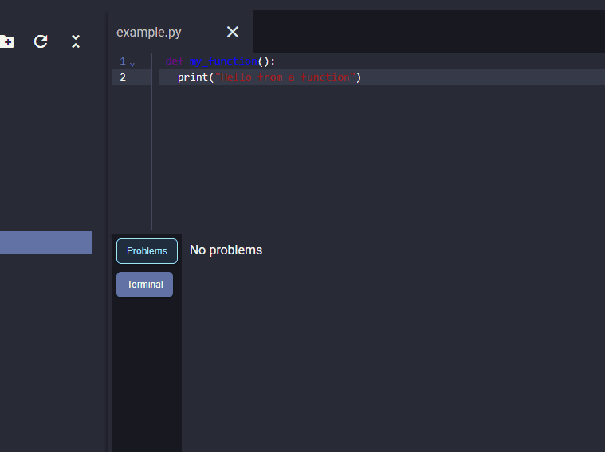

# **Flufy**




A simple text editor written in electron and angular

---

## Features

- TypeScript server LSP support / UI errors

- Search file, folder contents with Ripgrep and fsearch

- Basic Git view to show working tree information

- Node PTY integrated terminals - full terminal features

- View text files, images, and PDFs with syntax highlighting, code editing, and saving

- Create custom themes and switch between them

- Hot key support

- Markdown previews

- JSON RPC LSP support for now python pyright support

---

## **Project Overview**

- **`UI/`** – Contains the frontend source code (built with **Angular**)
- **`Desktop/`** – Contains the Electron desktop wrapper (built with **Electron** and **esbuild**)
- **`Scripts/`** – Contains custom build scripts for packaging the Angular app with Electron

---

## **Running the Project**

1. Refer to the **UI** folder’s README for frontend setup and development instructions.
2. Refer to the **Desktop** folder’s README for Electron-specific setup and running instructions.

---

## **Building for Production**

Under construction - after adding node pty and lsp support i need to fix it for new versions

1. **Install script dependencies:**

   ```bash
   cd scripts
   npm ci
   ```

2. **Set the build mode to production:**
   - Open `desktop/.env`
   - Change the value of `mode` to `prod`

3. **Run the build script from the project root:**

   ```bash
   node .\scripts\build.js --platform=windows
   ```

4. **Verify the build:**
   - Navigate to the `dist` folder
   - Run:

     ```bash
     .\electron.exe
     ```

   - The app should open successfully.

For now you can only build for x64 and the current OS your on as `homebridge node pty` downloads specific binarys based on machine and can't be configured
so if you want to build for a specific platform you need to run the above script on said machine - for now github actions do that so in future after build publish the artifact for distribution

# External libs maintained by me

Libarys that i wrote to use in flufy and are generic

- `umbr-resizer-two` - Dynamic panel resizer plain js
- `fsearch` CLI tool to search for files or folders in go
- `binman` CLI tool to install external binarys and NPM package `umbr-binman` in go
- `umbr-dl` - Simple download npm package around a go binary
- `umbr-zip` - Simple npm package wraps a go binary to zip and unzip folders really fast.
- `umbr-key-master` Vanilla JS lib to listen to keyboard dom events combos and run logic with w3 spec


# Formating 

Format your code with

```bash
npx prettier . --write
```