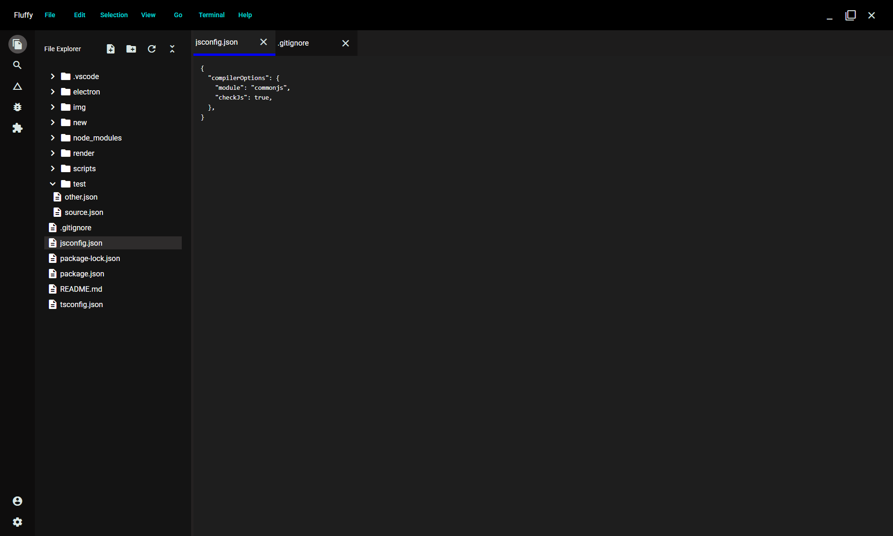

# **Flufy**



A simple text editor with desktop packaging support using Electron.

---

## **Feature Goals**

- Open a folder
- Display all files and folders in a sidebar
- Create new files or folders
- View files or folders by clicking on them
- Edit text content in files
- Use a custom build script to build the Angular app and package it with Electron

---

## **Project Overview**

- **`UI/`** – Contains the frontend source code (built with **Angular**)
- **`Desktop/`** – Contains the Electron desktop wrapper (built with **Electron** and **esbuild**)
- **`Scripts/`** – Contains custom build scripts for packaging the Angular app with Electron

---

## **Running the Project**

1. Refer to the **UI** folder’s README for frontend setup and development instructions.
2. Refer to the **Desktop** folder’s README for Electron-specific setup and running instructions.

---

## **Building for Production**

1. **Install script dependencies:**

   ```bash
   cd scripts
   npm ci
   ```

2. **Set the build mode to production:**

   - Open `desktop/.env`
   - Change the value of `mode` to `prod`

3. **Run the build script from the project root:**

   ```bash
   node .\scripts\build.js --platform=windows
   ```

4. **Verify the build:**

   - Navigate to the `dist` folder
   - Run:

     ```bash
     .\electron.exe
     ```

   - The app should open successfully.

# External libs maintained by me

Libarys that i wrote to use in flufy and are generic

- `umbr-resizer-two` - Simple resize plain js libary
- `fsearch` CLI tool to search for files or folders
- `binman` CLI tool to install external binarys and NPM package `umbr-binman`
- `umbr-dl` - Simple download npm package around a go binary for large files ro folders, used in build script to download large electron binarys
- `umbr-zip` - Simple npm package wraps a go binary to zip and unzip folders really fast, for build script as electron binarys are big saves time
