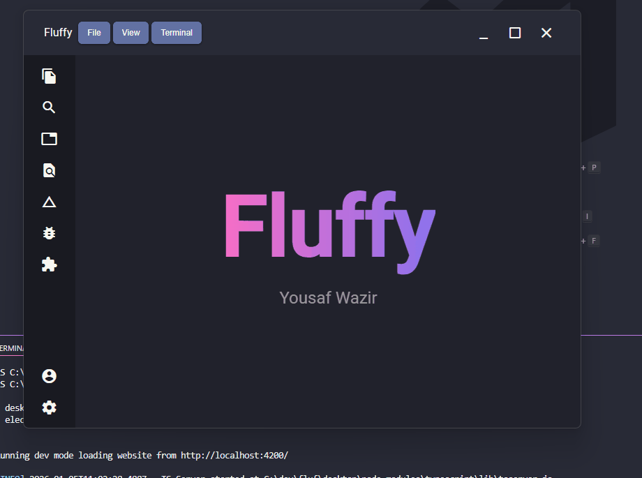
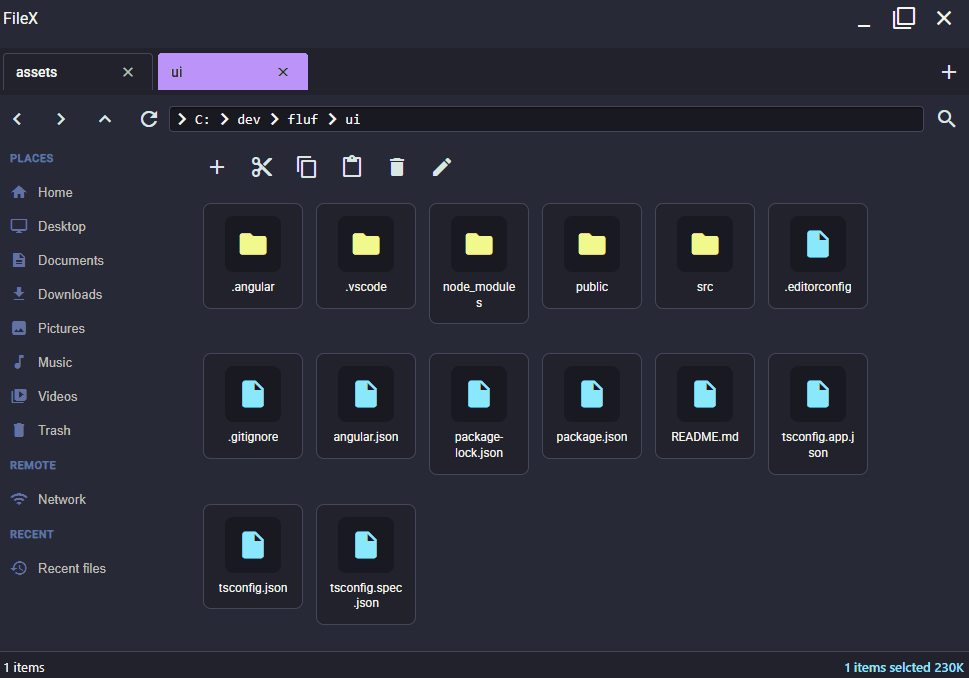

# **Flufy**

A simple text editor written in electron and angular

---

## Features

- Search file, folder contents with Ripgrep and fsearch

- Basic Git view to show working tree information

- Node PTY integrated terminals - full terminal features

- View text files, images, and PDFs with syntax highlighting, code editing, and saving

- Create custom themes and switch between them

- Hot key support

- Markdown previews

- Any JSON RPC LSP support for now python (pyright) and go (gopls) but can extend easily to add new ones and custom TypeScript impl (UI errors etc)

- Hover information and auto complete via LSP

- Go to definition

- Open a custom file explorer `Filex` which has all file explorer functionality

- Command palette - search files, change themes

- Custom IPC protocol to change the UI via IPC clients such as cli tools

---

## **Project Overview**

- **`UI/`** – Contains the frontend source code (built with **Angular**)
- **`Desktop/`** – Contains the Electron desktop wrapper (built with **Electron** and **esbuild**)
- **`Build/`** - Build orchestration to build a final prod version of app combining all our custom code
- **`Packages/`** - Contains shared packages / contracts / libarys
- **`test/`** - Contains all our tests such as unit, sanity etc
- **`public/`** - Just contains files for readme to use

---

## **Running the Project**

1. Refer to the **UI** folder’s README for frontend setup and development instructions.
2. Refer to the **Desktop** folder’s README for Electron-specific setup and running instructions.

---

# External libs maintained by me

Libarys that i wrote to use in flufy and are generic

- `umbr-resizer-two` - Dynamic panel resizer plain js
- `fsearch` CLI tool to search for files or folders in go
- `binman` CLI tool to install external binarys and NPM package `umbr-binman` in go
- `umbr-dl` - Simple download npm package around a go binary
- `umbr-zip` - Simple npm package wraps a go binary to zip and unzip folders really fast.
- `umbr-key-master` Vanilla JS lib to listen to keyboard dom events combos and run logic with w3 spec
- `node-logy` - Logger libary for node and adds logs to log files with extra's stuff i want - only about 15% slower than fatest one out there pino - handle 230K logs per second
- `node-github-actions` - Offers easy utils for writing scripts in general and github action event load parsing and general helper method for working inside actions.